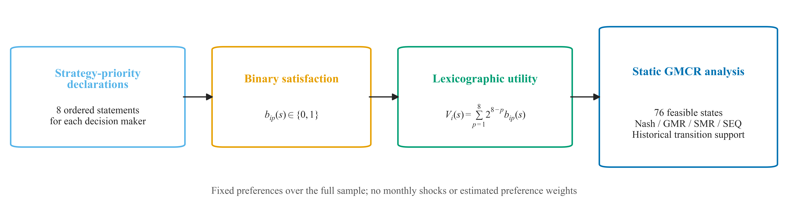
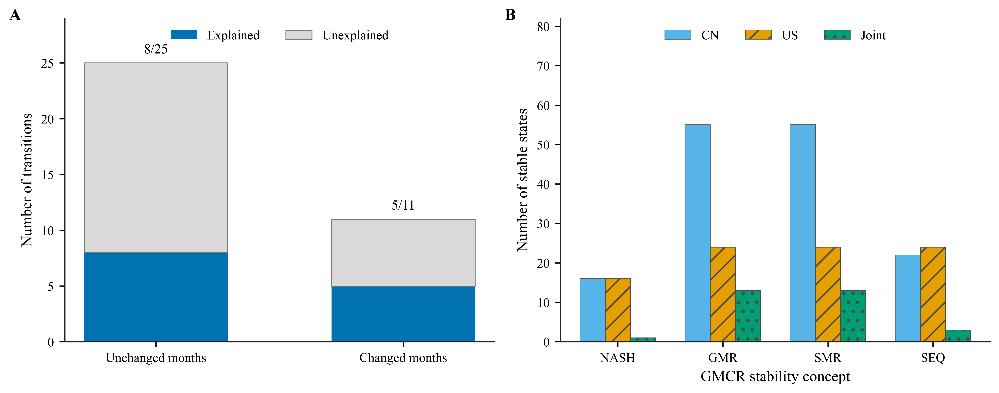
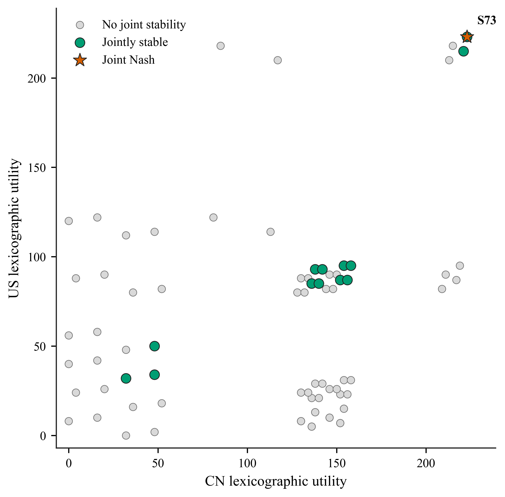
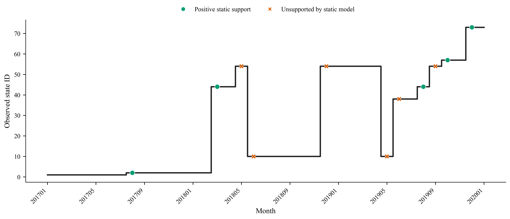
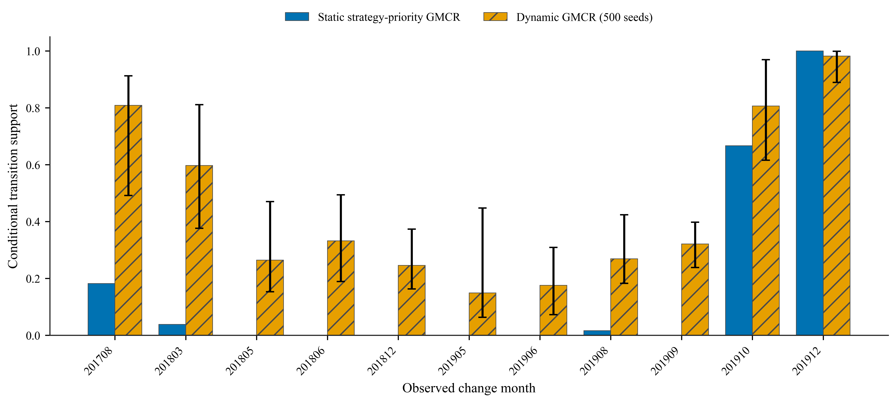
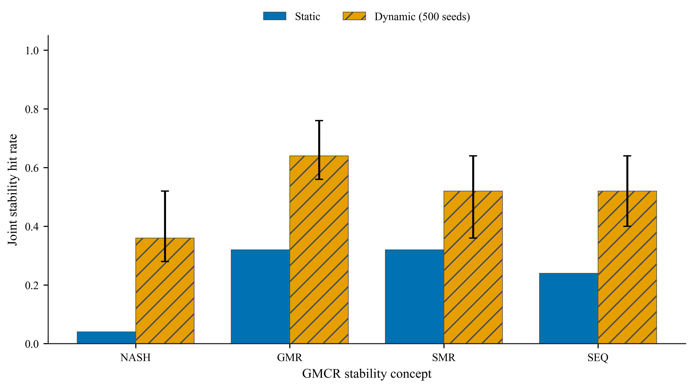

# 基于策略优先声明的静态 GMCR 模型实验

## 1. 模型设定与偏好获取

为检验时变偏好机制相对于固定偏好基准的增量解释力，本文在与动态模型完全一致的状态空间、单方可达关系及历史观测序列上构建静态 GMCR 模型。样本覆盖 2017 年 1 月至 2020 年 1 月，共包含 37 个月、36 个相邻月份转移和 76 个可行状态，其中状态变化 11 次、状态保持 25 次。静态模型在整个样本期内保持偏好结构不变，不引入月度事件冲击、时变偏好状态或待估偏好参数。

静态偏好采用**策略优先声明法**获得。对决策者 \(i\) 的第 \(p\) 条声明，令 \(b_{ip}(s)\in\{0,1\}\) 表示状态 \(s\) 是否满足该声明。声明按优先级由高到低排列，高优先级声明的满足优先于所有低优先级声明。为将该字典序关系转换为可用于 GMCR 改进判断的序数效用，定义

\[
V_i(s)=\sum_{p=1}^{8}2^{8-p}b_{ip}(s),
\]

对应的编码权重依次为 128、64、32、16、8、4、2 和 1。该权重仅用于保持声明的字典序，不代表由样本估计得到的偏好强度，也不参与参数优化。由此得到每个决策者对 76 个可行状态的固定偏好排序，并在状态转移图上计算 Nash、GMR、SMR 和 SEQ 稳定性以及历史转移的条件支持度。



图 1　静态策略优先偏好的构造过程。图中文字均为英文 Times New Roman，图内未设置标题。

## 2. 策略优先声明

中国与美国各设置 8 条理论先验声明。完整机器可读版本及文字依据见 [`strategy_priority_declarations.csv`](strategy_priority_declarations.csv)。声明表如下。

| 决策者 | 优先级 | 声明编号 | 策略优先声明 | 字典序权重 |
|---|---:|---|---|---:|
| 中国 | 1 | CN-P1 | U1 = 0 | 128 |
| 中国 | 2 | CN-P2 | U4 = 1 且 C4 = 1 | 64 |
| 中国 | 3 | CN-P3 | U1 = 1 且 C1 = 1 | 32 |
| 中国 | 4 | CN-P4 | C3 = 1 | 16 |
| 中国 | 5 | CN-P5 | U2 = 1 | 8 |
| 中国 | 6 | CN-P6 | U3 = 1 且 C2 = 1 | 4 |
| 中国 | 7 | CN-P7 | U1 = 0 且 C1 = 0 | 2 |
| 中国 | 8 | CN-P8 | C4 = 1 | 1 |
| 美国 | 1 | US-P1 | C2 = 1 且 C4 = 1 | 128 |
| 美国 | 2 | US-P2 | U4 = 1 | 64 |
| 美国 | 3 | US-P3 | C2 = 0 且 U1 = 1 | 32 |
| 美国 | 4 | US-P4 | U3 = 1 | 16 |
| 美国 | 5 | US-P5 | C1 = 0 | 8 |
| 美国 | 6 | US-P6 | U2 = 1 | 4 |
| 美国 | 7 | US-P7 | C3 = 1 | 2 |
| 美国 | 8 | US-P8 | U1 = 0 且 U2 = 1 | 1 |

其中，U1-U4 表示美国可控制选项，C1-C4 表示中国可控制选项。状态层面的声明满足向量、效用值与排序分别见 [`state_priority_satisfaction.csv`](state_priority_satisfaction.csv) 和 [`static_state_utilities.csv`](static_state_utilities.csv)。

## 3. 静态模型结果

### 3.1 历史保持与变化的解释

在 25 次历史状态保持中，有 8 次满足“双方均至少满足一种稳定性概念”的宽松判据，解释率为 32.0%；其余 17 次未被该固定偏好结构解释。在 11 次历史状态变化中，有 5 次获得正的条件转移支持，解释率为 45.5%，其余 6 次的支持度为 0。11 次状态变化的平均条件支持度为 0.173，观测目的状态的平均条件排名为 43.45。逐月结果见 [`historical_explanation.csv`](historical_explanation.csv)。



图 2　静态模型对历史状态保持与变化的解释结果，以及各稳定性概念下的稳定状态数量。

### 3.2 稳定状态识别

在 76 个可行状态中，共有 13 个状态至少满足一种联合稳定性概念。联合 Nash 稳定状态仅有 S73；联合 GMR、SMR 和 SEQ 稳定状态分别为 13、13 和 3 个。完整判定见 [`static_state_stability.csv`](static_state_stability.csv)。图 3 将双方字典序效用与联合稳定性对应起来，其中星形标记为唯一的联合 Nash 状态。



图 3　静态字典序效用与联合稳定状态分布。

### 3.3 历史路径中的解释位置

静态模型获得正支持的变化月份为 2017-08、2018-03、2019-08、2019-10 和 2019-12；未获支持的变化月份为 2018-05、2018-06、2018-12、2019-05、2019-06 和 2019-09。图 4 使用不同颜色和点形区分两类结果，因此在灰度打印条件下仍可辨识。



图 4　历史状态路径及静态模型对状态变化的支持情况。

## 4. 与动态偏好模型的比较

动态参照基于开发阶段 `DynamicGMCR/output/seed_*` 下的 500 个有效随机种子；公开版不附带这些大体量运行目录，而是保留其汇总结果。图中动态柱为跨种子中位数，误差线表示 5%–95% 分位区间。逐月比较、种子层指标和汇总指标分别见 [`static_dynamic_monthly_comparison.csv`](static_dynamic_monthly_comparison.csv)、[`dynamic_all_seed_metrics.csv`](dynamic_all_seed_metrics.csv) 和 [`static_dynamic_metric_comparison.csv`](static_dynamic_metric_comparison.csv)。

| 指标 | 静态策略优先模型 | 动态偏好模型中位数 | 5%–95% 区间 |
|---|---:|---:|---:|
| 变化期正支持率 | 45.5% | 100.0% | 100.0%–100.0% |
| 变化期平均条件支持度 | 0.173 | 0.442 | 0.414–0.510 |
| 保持期联合 Nash 命中率 | 4.0% | 36.0% | 28.0%–52.0% |
| 保持期联合 GMR 命中率 | 32.0% | 64.0% | 56.0%–76.0% |
| 保持期联合 SMR 命中率 | 32.0% | 52.0% | 36.0%–64.0% |
| 保持期联合 SEQ 命中率 | 24.0% | 52.0% | 40.0%–64.0% |



图 5　静态与动态模型对 11 次历史状态变化的条件支持度比较。



图 6　静态与动态模型对历史保持月份的联合稳定性命中率比较。

实验结果表明，固定策略优先声明能够重现若干关键历史转移，并在部分阶段识别出稳定状态，但其总体历史相容性明显低于动态偏好模型。差异主要集中于连续冲击阶段的转移支持以及保持期的联合稳定性识别。这说明历史状态序列包含随时间变化的偏好信息，单一固定的策略优先结构适合作为结构性基准，但不足以充分解释全部阶段转换。

## 5. 解释边界与复现

上述结果属于历史相容性检验，不应解释为未来转移的因果概率。策略优先声明来源于理论先验，而非对历史转移的反向拟合；因此，静态模型的解释缺口不能单独证明某一事件造成了偏好变化。动态模型的优势也应理解为更高的阶段性相容性，而不是对真实心理偏好或行动概率的直接观测。

静态实验已完整迁入 DynamicGMCR，可按以下顺序复现：

```powershell
python DynamicGMCR\cod\run_static_strategy_baseline.py
python DynamicGMCR\cod\generate_static_baseline_figures.py
python DynamicGMCR\cod\compare_static_dynamic_all_seeds.py
python -m unittest DynamicGMCR.tests.test_static_strategy_baseline -v
```

所有静态实验表格、汇总和图形均位于 `DynamicGMCR/results/static_baseline/`。图中文字全部为英文 Times New Roman，图内无标题；每张图均提供 SVG、PDF 和 600 dpi PNG 三种格式。
